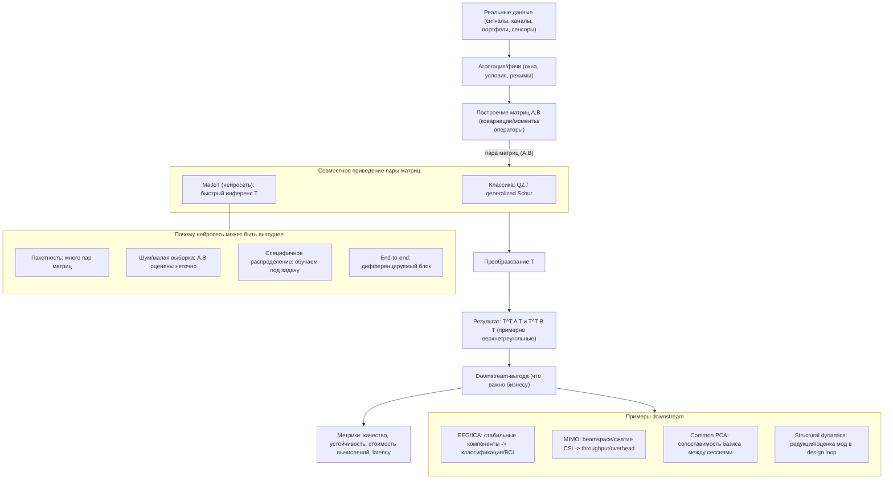

# Прикладные области joint triangularization (MaJoT)

## Введение (зачем это исследование)

В нашем контексте даны две (обычно симметричные) матрицы $A, B \in \mathbb{R}^{n\times n}$. Мы ищем обратимую (часто — ортогональную/почти ортогональную) матрицу $T$, такую что $T^\top A T$ и $T^\top B T$ обе **верхнетреугольные** (или «насколько возможно» верхнетреугольные при наличии шума/неидеальности модели). Это можно рассматривать как:

- «ослабленную» форму одновременной диагонализации (когда диагонализация недостижима или нестабильна),
- вариант логики **generalized Schur / QZ** для пар матриц (matrix pencil $A-\lambda B$),
- способ получить общий базис, в котором пара матриц становится более «каузальной/иерархичной» (зависимости уходят выше диагонали).

Классика (QZ / generalized Schur, Jacobi-type, pencil Schur) даёт надёжную точность, но в прикладных пайплайнах часто возникает давление по:

1. **скорости в пакетном режиме** (тысячи–миллионы пар матриц),
2. **устойчивости к шуму и приближённости** (матрицы — оценки, а не «истинные» операторы),
3. **встраиваемости в end-to-end оптимизацию** (хочется дифференцируемый и быстрый блок).

Нейросетевой подход к поиску $T$ потенциально выигрывает там, где:

- инференс должен быть **почти константным по числу итераций** (одно прохождение сети),
- матрицы приходят из **специфического распределения** (каналы связи, ковариации ЭЭГ, структурная динамика),
- нужно «лучшее приближение» при **модельном рассогласовании** (approximate joint triangularization).

Ниже — 4+ области, где задача возникает явно или неявно, и где можно осмысленно валидировать MaJoT на реальных данных.

---

## 4.2. Визуальная модель применения решения в жизни/бизнесе

Идея: в реальном продукте/системе редко важна «верхнетреугольность ради верхнетреугольности». Важен **downstream-эффект**: более стабильные компоненты, более компактное представление, лучшее разделение режимов, снижение вычислительных затрат или latency.

Ниже — универсальная схема того, где блок MaJoT появляется в пайплайне.

**Как валидировать эту модель на данных** (практический чек-лист):

- Выбрать домен (MIMO или EEG — наиболее перспективные из документа).
- Зафиксировать, как именно строятся $A, B$ (2 режима/2 окна/2 условия).
- Определить downstream-метрику (например, для MIMO: compression error/overhead; для EEG: стабильность компонент + качество классификации).
- Сравнить MaJoT vs классика по (a) quality, (b) latency/стоимости, (c) устойчивости к шуму/малому числу семплов.

---

## Область 1: Blind Source Separation / ICA / EEG (joint diagonalization -> triangularization)

### Как задача возникает

В ICA/BSS ��асто строят набор матриц (ковариации на лагах, кумулянты 4-го порядка и т.п.), которые в идеале становятся диагональными в базисе источников. Например, JADE формулируется как поиск ортогональной матрицы вращения, которая **совместно диагонализует** кумулянтные матрицы.

В реальных данных строгая диагонализация нарушена (шум, неполная независимость, артефакты). Тогда **триангуляризация** — более слабая, но иногда более стабильная цель: мы стремимся получить базис $T$, в котором «взаимные влияния» между латентными компонентами минимальны и структурированы выше диагонали.

- $A, B$: две матрицы вторых/четвёртых моментов (например, ковариации на двух лагах; или две «срезовые» матрицы кумулянтного тензора)
- $T$: матрица демикширования/вращения (spatial filter), перенос в пространство источников
- Верхнетреугольность: упорядочивание компонент так, что перекрёстные связи/корреляции «вытесняются» над диагональю

### Почему важна скорость

- ЭЭГ/MEG и телеком-потоки: много окон во времени, много субъектов/сессий -> **батч из тысяч пар** матриц
- Часто метод стоит внутри гиперпараметрического цикла (подбор окна, регуляризации, числа компонент)

### Данные / как симулировать

**Публичные данные**

- В качестве «реальных» матриц можно строить ковариации/кросс-ковариации из открытых EEG датасетов (например, PhysioNet EEG Motor Movement/Imagery), далее ковариации считаются локально.

**Синтетика**

Стандартная симуляция ICA: смешивание $X = M S$, где $S$ — независимые источники, затем оценка моментов и добавление шума/дрейфа, чтобы получить «approximate» условия.

### Насколько применимо нейросетевое решение

**Где классика страдает здесь**

- Много матриц/окон: итеративные методы совместной диагонализации в батче становятся узким местом
- Шум/неидеальность: точная постановка (диагонализация) ломается -> требуется approximate-версия, а критерии/остановки сильно влияют

**Потенциал нейросети**

- Обучение на распределении «ковариаций ЭЭГ/телеком» может дать быстрый и устойчивый $T$ для приближённой триангуляризации
- Можно сделать дифференцируемый блок для end-to-end BCI/denoising пайплайна

**Риск**: классические методы часто уже достаточно быстры при небольших $n$ ($n \approx 16$–$128$), так что выигрыш будет в основном в стабильности/батче, а не в одном прогоне.

---

## Область 2: Structural dynamics / modal analysis (обобщённые собственные значения $Kx = \lambda Mx$)

### Как задача возникает

В модальном анализе конструкций после дискретизации (например, FEM) получаем обобщённую задачу на собственные значения:

$$
K\,\phi = \lambda M\,\phi.
$$

Здесь $K$ — матрица жёсткости, $M$ — матрица масс. Это канонический пример generalized eigenvalue problem.

- $A, B$: $A = K$, $B = M$ (или вариации с демпфированием/редукцией)
- $T$: модальная матрица (базис форм колебаний) или преобразование редукции
- Верхнетреугольность: связана с приведением pencil к обобщённой форме Шура (QZ), где пара становится квазитреугольной/треугольной, и спектр читается устойчиво

### Почему важна скорость

- Большие FEM-модели: $n$ легко уходит в $10^4$–$10^6$ (хотя часто используют разреженные методы и считают только часть спектра)
- Пакетность: оптимизация конструкции (design loops), uncertainty quantification, цифровые двойники -> нужно многократно решать похожие задачи

### Данные / как симулировать

**Публичные источники**

- В качестве вводного материала по постановке и интерпретации $K, M$ можно опираться на открытые учебные материалы по generalized eigenvalue в вибрации/акустике.

**Синтетика**

- Генерация SPD матриц $M \succ 0$, $K \succ 0$ с контролируемой разреженностью/условностью (моделируя FEM-структуру), затем добавление шумов измерений/модельных ошибок.

### Насколько применимо нейросетевое решение

**Где классика сильна**

- QZ и разреженные солверы — золотой стандарт по точности/устойчивости

**Где может возникнуть ниша для нейросети**

- Быстрая аппроксимация «редуцирующего» преобразования $T$ для семейства близких задач (parametric structures), где нужна скорость в design loop
- При наличии шума (из system identification), когда $K, M$ — оценённые матрицы и требуется устойчивое приближение

**Риск**: для очень больших $n$ хранить плотный $T$ невозможно; потребуется либо структурированный $T$ (блочный/разреженный), либо работа на редуцированном подпространстве.

---

## Область 3: MIMO / massive MIMO статистика канала (в т.ч. декорреляция по ковариациям)

### Как задача возникает

В беспроводной связи базовая модель: $y = Hx + n$, где $H$ — MIMO-канальная матрица. В задачах приёмника/прекодинга часто используют вторые статистики: ковариации по антеннам/пользователям/поднесущим, которые в идеале диагонализуются в собственном базисе корреляции.

Триангуляризация пары $A, B$ появляется, например, как способ получить общий базис для двух режимов/окон статистики (uplink vs downlink, два частотных диапазона, два временных окна, две группы пользователей).

- $A, B$: две ковариационные/кросс-ковариационные матрицы канала или оценок CSI (например, $R_1 = \mathbb E[H_1^\* H_1]$, $R_2 = \mathbb E[H_2^\* H_2]$ на двух условиях)
- $T$: преобразование в «почти собственный» базис пространственных мод (beamspace), пригодное для декорреляции/сжатия
- Верхнетреугольность: компромисс, когда общего ортогонального базиса диагонализации нет из-за рассогласования статистик

### Почему важна скорость

- Massive MIMO: много антенн, много поднесущих, много локаций -> огромный батч задач, иногда близко к real-time

### Данные / как симулировать

**Открытые датасеты (прямо про MIMO-матрицы)**

- DeepMIMO — фреймворк для генерации крупномасштабных MIMO датасетов (ray-tracing), «matrix-centric» форматы
- RENEW datasets (Rice) — открытые измеренные massive MIMO каналы
- Sub-6GHz MIMO channel sounding dataset (Niigata University) — измерения 8×8 MIMO

**Синтетика**

3GPP/COST2100/DeepMIMO-генерация CSI, далее построение ковариаций на разных окнах/условиях.

### Насколько применимо нейросетевое решение

**Где классика страдает**

- Быстро меняющиеся условия и необходимость многократной обработки статистик (особенно в симуляторах/оптимизации)
- При оценке ковариаций из малого числа семплов матрицы шумные/плохо обусловленные

**Потенциал нейросети**

- Обучить быстрый «triangularizer» для типовых распределений каналов (геометрия сцены, массивы антенн), чтобы ускорить downstream: beamforming, compression, feedback

**Риск**: требуется аккуратно определить метрику полезности: не «насколько треугольная матрица», а выигрыш в системной метрике (BER, capacity proxy, NMSE канала, overhead).

---

## Область 4: Common PCA / нейронауки / кросс-сессионные ковариации (общий базис)

### Как задача возникает

В многомерной статистике и нейронауках часто есть несколько ковариационных матриц, соответствующих разным условиям/сессиям/субъектам. Задача common principal components ищет общий базис, в котором ковариации «максимально» диагональны. В двух-матрицном частном случае это естественно сводится к совместному приведению пары ковариаций.

- $A, B$: ковариации нейросигналов в двух состояниях/условиях или двух сессиях
- $T$: общий базис пространственных компонент (нейронные «моды»), пригодный для сравнения/переноса
- Верхнетреугольность: более мягкая цель, когда у двух условий нет общего базиса диагонализации (или он нестабилен из-за шума/малой выборки)

### Почему важна скорость

- Часто важнее **устойчивость**, чем скорость: матрицы небольшие ($n \approx 20$–$300$), но матриц много (много субъектов/окон)

### Данные / как симулировать

**Реальные данные**

- Можно брать открытые EEG/MEG/fMRI датасеты и строить ковариации по субъектам/условиям.

**Синтетика**

- Модель: $A = T^{-\top}\Lambda_1 T^{-1} + \epsilon$, $B = T^{-\top}\Lambda_2 T^{-1} + \epsilon$ с контролем спектров и уровня шума/смещения.

### Насколько применимо нейросетевое решение

**Где классика страдает**

- При малой выборке ковариации шумные; точные методы дают нестабильные базисы
- Требуется регуляризация и аккуратная настройка

**Потенциал нейросети**

- Можно обучить $T$ как функцию пары ковариаций с явной устойчивостью к шуму (data augmentation) и с приоритетом на downstream-метрику (transfer learning между условиями)

**Риск**: если $n$ мал и вычислительный бюджет не критичен, преимущество нейросети надо доказывать через устойчивость/качество downstream, а не через «скорость QZ».

---

## (Опционально) Область 5: Financial covariance (несколько окон риска)

Связь концептуально похожа на common PCA: $A, B$ — ковариации доходностей на двух окнах/режимах рынка; $T$ — базис факторов. Триангуляризация может быть разумной, когда рынки не стационарны и нет общего базиса диагонализации. Датасеты обычно доступны (например, Yahoo Finance/Quandl), но юридически/лицензионно нужно аккуратно выбирать источник. В текущем документе оставляем как «вторую волну».

---

## Сравнительная таблица

| Область | Как возникает (A, B) | Типичный $n$ | Нужна скорость? | Есть данные? | Перспективность нейросети |
|---|---|---:|---|---|---|
| ICA/BSS (EEG/аудио/телеком) | 2 матрицы моментов (ковариации на лагах / кумулянты) | 16–256 | Да (батч/окна) | Да (EEG датасеты -> ковариации), синтетика ICA | H |
| Structural dynamics / FEM | $K$ (жёсткость), $M$ (массы) | $10^4$–$10^6$ (часто редукция) | Иногда (design loop) | Скорее синтетика/симуляции | M/L |
| MIMO / massive MIMO | 2 ковариации/статистики канала в разных условиях | 8–256+ | Да (много локаций/поднесущих) | Да (DeepMIMO / RENEW / sounding) | H |
| Common PCA / neuro | 2 ковариации условий/сессий | 20–300 | Скорее «устойчивость» | Да (neuro датасеты -> ковариации), синтетика | M |
| Finance (опц.) | 2 ковариации на разных окнах | 20–500 | Да (портфельные переборы) | Да, но нужны проверки лицензий | M |

---

## Топ-2 перспективных области (куда валидировать в первую очередь)

1. **MIMO / massive MIMO статистика канала.** Есть открытые датасеты с матрицами канала и легко строить пары ковариаций для разных условий; высокая батчевость и потенциальный выигрыш от быстрого инференса.
2. **ICA/BSS на ЭЭГ (joint diagonalization -> approximate triangularization).** Природная approximate-постановка из-за шума/артефактов; много окон/субъектов; можно проверять устойчивость и качество разделения источников.

---

## Где нейросетевой подход, скорее всего, не даст преимущества

- **Чистые generalized eigenvalue задачи малого размера**, где QZ решает быстро и точно, а батч небольшой: нейросеть сложно оправдать, особенно если нужен гарантированный контроль ошибок
- **Очень большие FEM-задачи без редукции**, где хранение/применение плотного $T$ и так невозможно: проблема не в QZ, а в масштабе и разреженности; нужны специализированные разреженные методы и/или подпространственные солверы

---

## Гипотезы/вопросы для следующих экспериментов

1. **MIMO-гипотеза:** обученная на DeepMIMO сеть для $T$ даст сопоставимую (или лучшую) downstream-метрику (например, capacity proxy / beamspace sparsity / feedback compression error) при меньших вычислениях, чем итеративная approximate joint diagonalization/triangularization.
2. **EEG-гипотеза:** при фиксированном бюджете данных (малое число семплов на ковариацию) нейросетевой $T$ будет **стабильнее** (меньше вариативность базиса меж��у окнами) и даст лучшую разделимость компонент по сравнению с классическими JD-итерациями.
3. **Практический тест:** добавить финансовые ковариации размера $50\times 50$ как OOD-проверку устойчивости (даже если это не топ-область).
